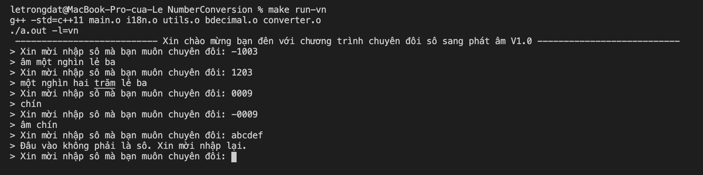

# Number conversion

## Introduction

A program that converts numbers to their text representation.

Example:

**Input:**

1123

**Output:**

one thousand one hundred twenty-three

## Options

    [-l]=<value>    Language code (Supported language of current version: en(english), vn(vietnamese)).
    [-h]            List of all available options.

## Run

    make run-vn:    Run the programm with vietnamese language.
    make run-en:    Run the programm with english language.
    make run-h:     See the list of all available options.

## Examples

1.Vietnamese language

2.English language

3.List of all available options

